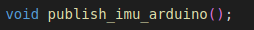
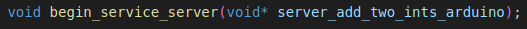
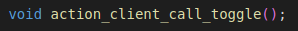
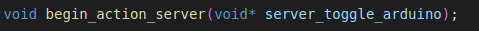

Xicro library API
=================
After making settings in the file setup_xicro.yaml
and successfully generated a Xicro node and Xicro library.
We will need to deploy the Xicro library to the microcontroller.

* To use the generated Xicro library, you must use the Xicro node file created with the configuration file. Only setup_xicro.yaml is the same. 

Initialize Xicro library
************************
The xicro library has to be set up.

1. Declare the object xicro before calling Void Setup(). 

    .. image:: pic/declare_2.png
        :width: 420
        :height: 120
        :alt: Alternative text
        :align: center
2. Setup Xicro begin 
    1. Setup Xicro begin with uart

        .. image:: pic/setuart.png
            :width: 320
            :height: 100
            :alt: Alternative text
            :align: center

        1\. Set the communication baudrate to match the setting in the file. setup_xicro.yaml.

        2\. Enter the address of the UART to register the xicro library. (function begin())
    2. Setup Xicro begin with udp

        .. image:: pic/setudp.png
            :width: 320
            :height: 100
            :alt: Alternative text
            :align: center
        1\. Connect to wifi

        2\. Enter the address of the UDP(udpwifi.h) to register the xicro library. (function begin())
        
        3\. Enter the udpAddress and udpPort same setup_xicro.yaml to register the xicro library. (function begin())
    
3. Execute xicro process

    .. image:: pic/spin.png
        :width: 300
        :height: 80
        :alt: Alternative text
        :align: center

    Xicro process requires computation It is therefore defined that the function Spin_node() must always be in While(1).

    Warning!! 

        For maximum efficiency when programming embedded systems, you should not do anything that consumes too many resources or computation time. in while(1)
    
    

Publish
*******

    .. image:: pic/ex_setPub.png
        :width: 700
        :height: 175
        :alt: Alternative text
        :align: center

    Example of using publish mode settings in setup_xicro.yaml file

How to implement xicro library in this mode

    .. image:: pic/struct_pub.png
        :width: 420
        :height: 480
        :alt: Alternative text
        :align: center

    The generated struct will have the pattern Publisher\_(Name_of_Topic).message.(data in interface file)

1. The first construct is the interface massage struct. It follows the interface file structure.

    Use this struct to include the information you want to publish.
   

The generated function will have the pattern publish\_(Name_of_Topic)();

2. When you finish entering the information in struct that you want to publish, use this function to send it to the ROS2 system.

Subscribe
*********

    .. image:: pic/ex_setSub.png
        :width: 700
        :height: 175
        :alt: Alternative text
        :align: center

    Example of using subscribe mode settings in setup_xicro.yaml file

How to implement xicro library in this mode

    .. image:: pic/struct_sub.png
        :width: 280
        :height: 650
        :alt: Alternative text
        :align: center

    The generated struct will have the pattern Subscription\_(Name_of_Topic).message.(data in interface file)

The construct is the interface massage struct. It follows the interface file structure.

    When subcribe the data from ROS2, the data will be updated in this struct and can be used immediately.

Service client
**************

    .. image:: pic/ex_setSrvClient.png
        :width: 700
        :height: 175
        :alt: Alternative text
        :align: center

    Example of using service client mode settings in setup_xicro.yaml file

How to implement xicro library in this mode

    .. image:: pic/struct_srvclient.png
        :width: 320
        :height: 300
        :alt: Alternative text
        :align: center

    The generated struct will have the pattern 
        1. Service_client\_(Name_of_Service).request.(data request in interface file)
        2. Service_client\_(Name_of_Service).response.(data response in interface file)
        3. Service_client\_(Name_of_Service).state is state of service client (only xicro)

1. The first construct is the interface struct.request  It follows the interface file structure.

    Use this struct.request to include the information you want to request.
   

The generated function will have the pattern service_client_call\_(Name_of_Service)();

2. When you finish entering the information in struct that you want to service call, use this function to service call it to the ROS2 system.

3. While doing service_call you can check state by using below struct which is embedded in xicro library.
            
    .. image:: pic/state_srv_client.png
        :width: 320
        :height: 150
        :alt: Alternative text
        :align: center

4. When the service call is done, check by state if state==get_response_done .

    The data will be updated in this struct.response and can be used immediately.

Service server
**************

    .. image:: pic/ex_setSrvServer.png
        :width: 700
        :height: 155
        :alt: Alternative text
        :align: center

    Example of using service server mode settings in setup_xicro.yaml file

How to implement xicro library in this mode

    .. image:: pic/struct_srv_server.png
        :width: 320
        :height: 280
        :alt: Alternative text
        :align: center

    The generated struct will have the pattern 
        1. Service_server\_(Name_of_Service).request.(data request in interface file)
        2. Service_server\_(Name_of_Service).response.(data response in interface file)
        3. Service_server\_(Name_of_Service).state is state of service server (only xicro)

1. The first step is to register by entering the address of the void.

The generated function will have the pattern void begin_service_server(void* service1,void* service2,.....);

2. When there is a service_call from the ROS2 xicro library, the function is called. registered automatically

    The data will be updated in this struct.request and can be used immediately.

3. When you want to send_response

    1. Use this struct.response to include the information you want to send_response.

     
    .. image:: pic/function_srv_server_response.png
        :width: 350
        :height: 50
        :alt: Alternative text
        :align: center

    The generated function will have the pattern service_server_response\_(Name_of_Service)();

    2. When you finish entering the information in struct that you want to service send response, use this function to service send response it to the ROS2 system.

Action client
*************

    .. image:: pic/ex_setAction_client.png
        :width: 700
        :height: 175
        :alt: Alternative text
        :align: center

    Example of using action client mode settings in setup_xicro.yaml file

How to implement xicro library in this mode

    .. image:: pic/struct_action_client.png
        :width: 280
        :height: 300
        :alt: Alternative text
        :align: center

    The generated struct will have the pattern 
        1. Action_client\_(Name_of_Action).request.(data request in interface file)
        2. Action_client\_(Name_of_Action).result.(data response in interface file)
        3. Action_client\_(Name_of_Action).feedback.(data feedback in interface file)
        4. Action_client\_(Name_of_Action).state is state of action client (only xicro)

1. The first construct is the interface struct.request  It follows the interface file structure.

    Use this struct.request to include the information you want to request.
   

The generated function will have the pattern action_client_call\_(Name_of_Action)();

2. When you finish entering the information in struct that you want to action call, use this function to service call it to the ROS2 system.

3. While doing action_call you can check state by using below struct which is embedded in xicro library.
            
    .. image:: pic/state_action_client.png
        :width: 320
        :height: 200
        :alt: Alternative text
        :align: center

4. When the action call is done, check by state 

    The data will be updated in this struct.result ,struct.feedback and can be used immediately.
    
Action server
*************

    .. image:: pic/ex_setAction_server.png
        :width: 700
        :height: 155
        :alt: Alternative text
        :align: center

    Example of using action server mode settings in setup_xicro.yaml file

How to implement xicro library in this mode

    .. image:: pic/struct_action_server.png
        :width: 300
        :height: 280
        :alt: Alternative text
        :align: center

    The generated struct will have the pattern 
        1. Action_server\_(Name_of_Action).request.(data request in interface file)
        2. Action_server\_(Name_of_Action).result.(data response in interface file)
        3. Action_server\_(Name_of_Action).feedback.(data feedback in interface file)
        4. Action_server\_(Name_of_Action).state is state of action server (only xicro)

1. The first step is to register by entering the address of the void.

The generated function will have the pattern void begin_action_server(void* action1,void* action2,.....);

2. When there is a action_call from the ROS2 xicro library, the function is called. registered automatically

    The data will be updated in this struct.request and can be used immediately.

3. When you want to send_feedback

    1. Use this struct.feedback to include the information you want to send_feedback.

     
    .. image:: pic/function_action_server_feedback.png
        :width: 380
        :height: 50
        :alt: Alternative text
        :align: center

    The generated function will have the pattern action_server_send_feedback\_(Name_of_Action)();

    2. When you finish entering the information in struct that you want to action send feedback, use this function to action send feedback it to the ROS2 system.

4. When you want to send_result

    1. Use this struct.result to include the information you want to send_result.

     
    .. image:: pic/function_action_server_result.png
        :width: 380
        :height: 50
        :alt: Alternative text
        :align: center

    The generated function will have the pattern action_server_result\_(Name_of_Action)();

    2. When you finish entering the information in struct.result that you want to action send result, use this function to action send resulit to the ROS2 system.
